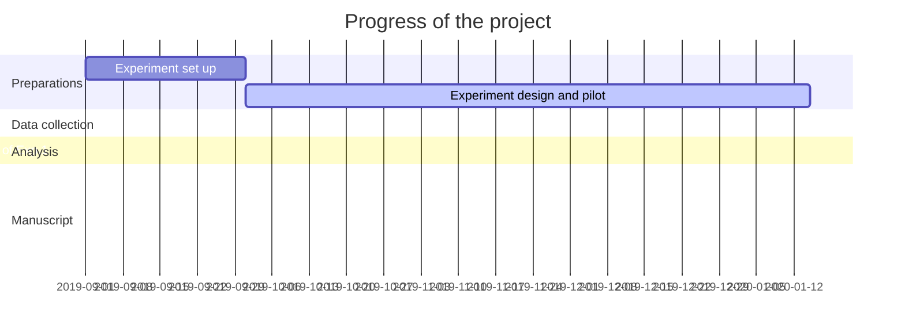

---
output:
  pdf_document: default
  html_document: default
---

## Progress

# To-do Task

* Preparations

    1. * [x]   set up with Python 3 and PsychoPy

    2. * [x]   color-generation codes 

* Experimental design

    1. * [x]   background study

    2. * [x]   paradiam design
    
    3. * [x]   input/output file organization
    
    4. * [x]   pilot test and preliminary data analysis 
    
    5. * [ ]   set up 10-bit monitor (high color-depth is required)
    
    
* Data collection

* Data analysis

