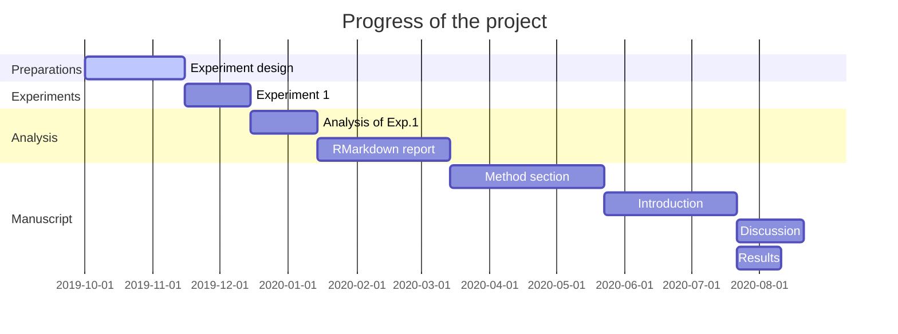

---
output:
  pdf_document: default
  html_document: default
---

## Progress

# To-do Task

* Experimental design

    1. * [x]   Background study

    2. * [ ]   Paradiam design
    
    3. * [ ]   Pilot test
    
* Data collection

* Data analysis

