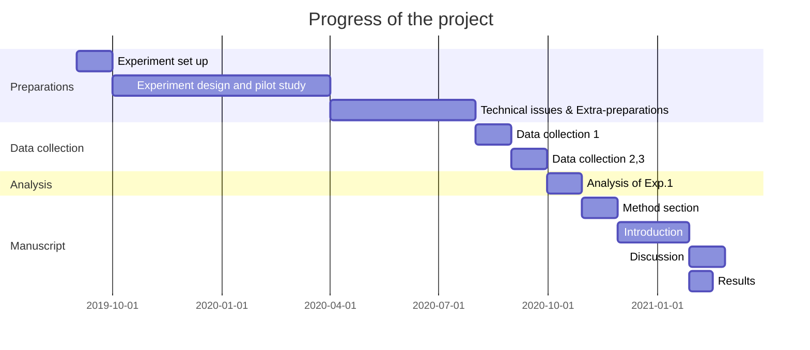

## Project Overview


---


## Progress




# To-do Task

* Preparations

    1. * [x]    set up with Python 3 and PsychoPy

    2. * [x]    color-generation codes 

* Experimental design

    1. * [x]    background study

    2. * [x]    paradiam design
    
    3. * [x]    input/output file organization
    
    4. * [x]    pilot test and preliminary data analysis (8-bit)
    
    5. * [x]    staircase method comparision (GSN master intern project)

* Extra-preparations

    1. * [x]    set up 10-bit monitor (high color-depth is required)
    
        - set up VIEWPixx display
        
        - install AMD Radeon graphics card and AMD driver
        
        - upgrade and configure OS
        
    2. * [x]    C++ IRIS tools compilation & display calibration
    
    3. * [x]    metadata re-organization
    
    4. * [x]    pilot test and preliminary data analysis (10-bit)
    
* Data collection

    1. * [ ]    data collection 1: low-noise condition
    
    2. * [ ]    data collection 2: mixed-noise condition
    
    3. * [ ]    data collection 3: high-noise condition


* Data analysis


## Codes
The programming uses Psychopy (v2020.1) with Python 3.7 (Ubuntu 18.04.3 LTS).
The experiment stimuli can be implemented by 8-bit or 10-bit color depths.  

| *.py file | Description | Example functions/modules |
| --- | --- | --- |
| rgb2lms_plus | calibrate with a calibration file, transform between rgb and lms | calibration, transformation |
| isolum | (abandoned!) measure subject's isoluminance plane | isoslant, fitiso |
| colorpalette_plus | generates sml and RGB values with hue angles on an iso-luminance plane, and vice versa | ColorPicker|
| genconfig | (abandoned!) write and read experiment config files | ParWriter, ParReader, XppWriter, XppReader, XrlWriter, XrlReader |
| config_tools | write and read experiment config files | write_cfg, write_par, WriteXpp, write_xrl, read_yml |
| multinoisecolor10bit | excute the color noise experiment in 10-bit color depths| Exp, run_exp |
| screensaver | screen-protect program in a colored board patten | run_scrsaver |
| exploredata/pf_fitting.R | for preliminary data analysis (psychometric function fitting) | 

## Data structure
```
experiment directory  
│
└───config
│   └───colorlist         
│       └───subject       # lists of all achievable colors for this subject
|   |   expconfig.yaml    # experiment config YAML
│   │   parameter.yaml    # parameter YAML
│ 
└───isolum  
│   └───subject           # isoluminance measurement output for this subject
└───data
│   └───subject
|       |  subject_20200000T0000.yaml  # single session log YAML
|       |  subject.xrl                 # subject log file, records of all pairs of parameters and sessions belong to one subject 
|       |  subject20200000T0000.xlsx   # data from a compeleted session
|
```
